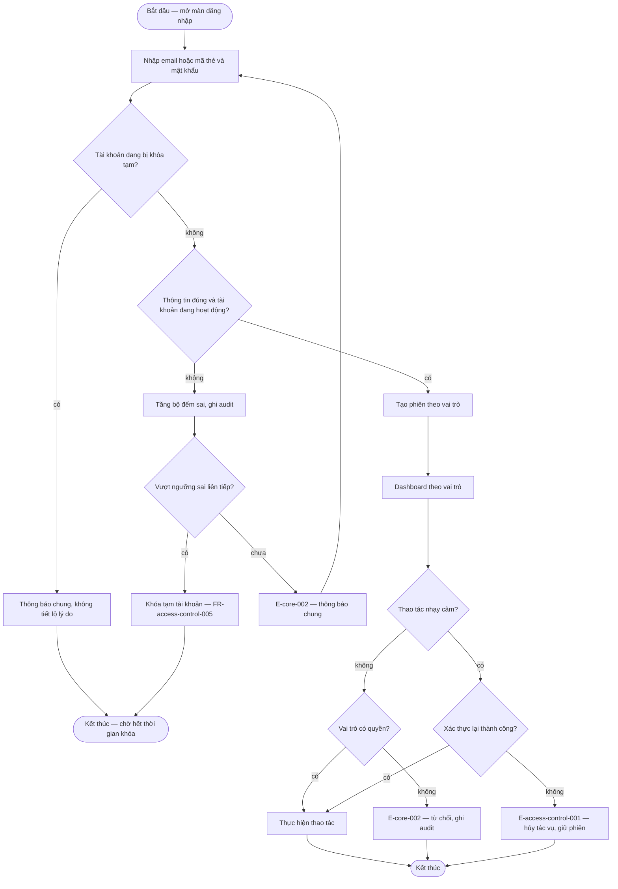

# access-control — Flows

## Flow: Đăng nhập, khóa tạm và xác thực lại

**Trigger:** Người dùng mở ứng dụng hoặc gọi tác vụ nhạy cảm. · **UC:** uc-access-control · **Release:** R0

```mermaid
flowchart TD
    Start(["Bắt đầu — mở màn đăng nhập"]) --> Input["Nhập email hoặc mã thẻ và mật khẩu"]
    Input --> Locked{"Tài khoản đang bị khóa tạm?"}
    Locked -->|"có"| MsgLock["Thông báo chung, không tiết lộ lý do"]
    MsgLock --> EndLock(["Kết thúc — chờ hết thời gian khóa"])
    Locked -->|"không"| Check{"Thông tin đúng và tài khoản đang hoạt động?"}
    Check -->|"không"| Count["Tăng bộ đếm sai, ghi audit"]
    Count --> Over{"Vượt ngưỡng sai liên tiếp?"}
    Over -->|"có"| Lock["Khóa tạm tài khoản — FR-access-control-005"]
    Lock --> EndLock
    Over -->|"chưa"| MsgFail["E-core-002 — thông báo chung"]
    MsgFail --> Input
    Check -->|"có"| Session["Tạo phiên theo vai trò"]
    Session --> Dash["Dashboard theo vai trò"]
    Dash --> Action{"Thao tác nhạy cảm?"}
    Action -->|"không"| Perm{"Vai trò có quyền?"}
    Perm -->|"không"| Deny["E-core-002 — từ chối, ghi audit"]
    Perm -->|"có"| Do["Thực hiện thao tác"]
    Action -->|"có"| StepUp{"Xác thực lại thành công?"}
    StepUp -->|"không"| Cancel["E-access-control-001 — hủy tác vụ, giữ phiên"]
    StepUp -->|"có"| Do
    Do --> End(["Kết thúc"])
    Deny --> End
    Cancel --> End
```
