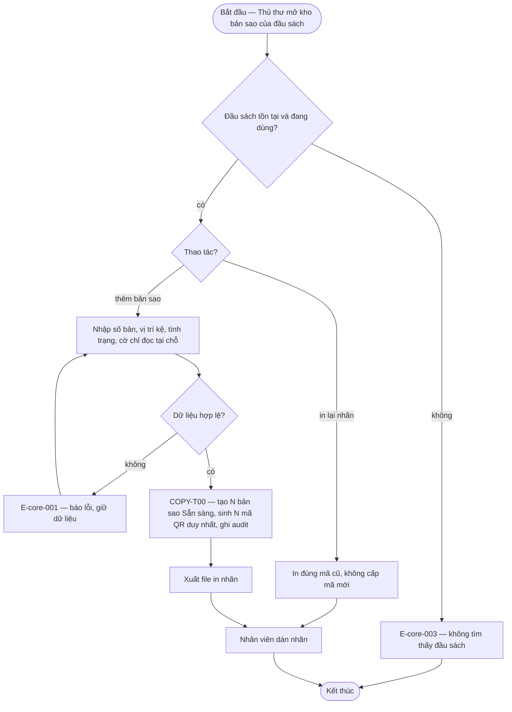

# copy-inventory — Flows

## Flow: Nhập bản sao và in nhãn QR

**Trigger:** Có sách mới nhập kho hoặc nhãn hỏng cần in lại. · **UC:** uc-copy-inventory · **Release:** R0

```mermaid
flowchart TD
    Start(["Bắt đầu — Thủ thư mở kho bản sao của đầu sách"]) --> Title{"Đầu sách tồn tại và đang dùng?"}
    Title -->|"không"| Err0["E-core-003 — không tìm thấy đầu sách"]
    Err0 --> End(["Kết thúc"])
    Title -->|"có"| Kind{"Thao tác?"}
    Kind -->|"thêm bản sao"| Input["Nhập số bản, vị trí kệ, tình trạng, cờ chỉ đọc tại chỗ"]
    Input --> Valid{"Dữ liệu hợp lệ?"}
    Valid -->|"không"| Err1["E-core-001 — báo lỗi, giữ dữ liệu"]
    Err1 --> Input
    Valid -->|"có"| Create["COPY-T00 — tạo N bản sao Sẵn sàng, sinh N mã QR duy nhất, ghi audit"]
    Create --> Print["Xuất file in nhãn"]
    Kind -->|"in lại nhãn"| Reprint["In đúng mã cũ, không cấp mã mới"]
    Reprint --> Stick["Nhân viên dán nhãn"]
    Print --> Stick
    Stick --> End
```
