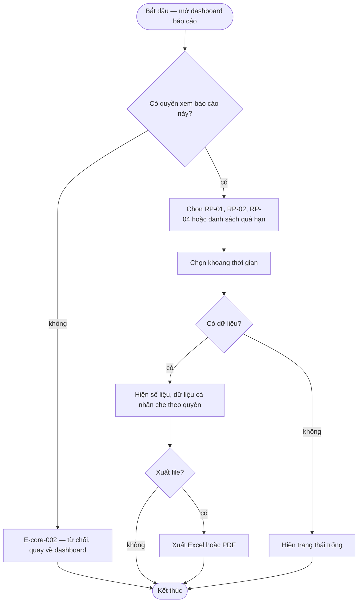

# ops-reports — Flows

## Flow: Xem và xuất báo cáo vận hành

**Trigger:** Người dùng mở dashboard báo cáo. · **UC:** uc-ops-reports · **Release:** R1A, R1B

```mermaid
flowchart TD
    Start(["Bắt đầu — mở dashboard báo cáo"]) --> Perm{"Có quyền xem báo cáo này?"}
    Perm -->|"không"| Deny["E-core-002 — từ chối, quay về dashboard"]
    Deny --> End(["Kết thúc"])
    Perm -->|"có"| Pick["Chọn RP-01, RP-02, RP-04 hoặc danh sách quá hạn"]
    Pick --> Range["Chọn khoảng thời gian"]
    Range --> Data{"Có dữ liệu?"}
    Data -->|"không"| Empty["Hiện trạng thái trống"]
    Data -->|"có"| Show["Hiện số liệu, dữ liệu cá nhân che theo quyền"]
    Show --> Export{"Xuất file?"}
    Export -->|"có"| File["Xuất Excel hoặc PDF"]
    Export -->|"không"| End
    File --> End
    Empty --> End
```
