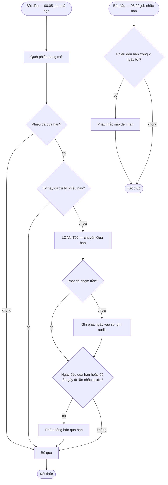

# overdue-fines — Flows

## Flow: Job quá hạn và nhắc hạn

**Trigger:** Job hằng ngày 00:05 và 08:00. · **UC:** uc-overdue-assessment · **Release:** R1A

```mermaid
flowchart TD
    Start(["Bắt đầu — 00:05 job quá hạn"]) --> Scan["Quét phiếu đang mở"]
    Scan --> Over{"Phiếu đã quá hạn?"}
    Over -->|"không"| Next["Bỏ qua"]
    Over -->|"có"| Done{"Kỳ này đã xử lý phiếu này?"}
    Done -->|"có"| Next
    Done -->|"chưa"| Mark["LOAN-T02 — chuyển Quá hạn"]
    Mark --> Cap{"Phạt đã chạm trần?"}
    Cap -->|"có"| Remind
    Cap -->|"chưa"| Fine["Ghi phạt ngày vào sổ, ghi audit"]
    Fine --> Remind{"Ngày đầu quá hạn hoặc đủ 3 ngày từ lần nhắc trước?"}
    Remind -->|"có"| Notify["Phát thông báo quá hạn"]
    Remind -->|"không"| Next
    Notify --> Next
    Next --> End(["Kết thúc"])
    Start2(["Bắt đầu — 08:00 job nhắc hạn"]) --> Due{"Phiếu đến hạn trong 2 ngày tới?"}
    Due -->|"có"| NotifyDue["Phát nhắc sắp đến hạn"]
    Due -->|"không"| End2(["Kết thúc"])
    NotifyDue --> End2
```
