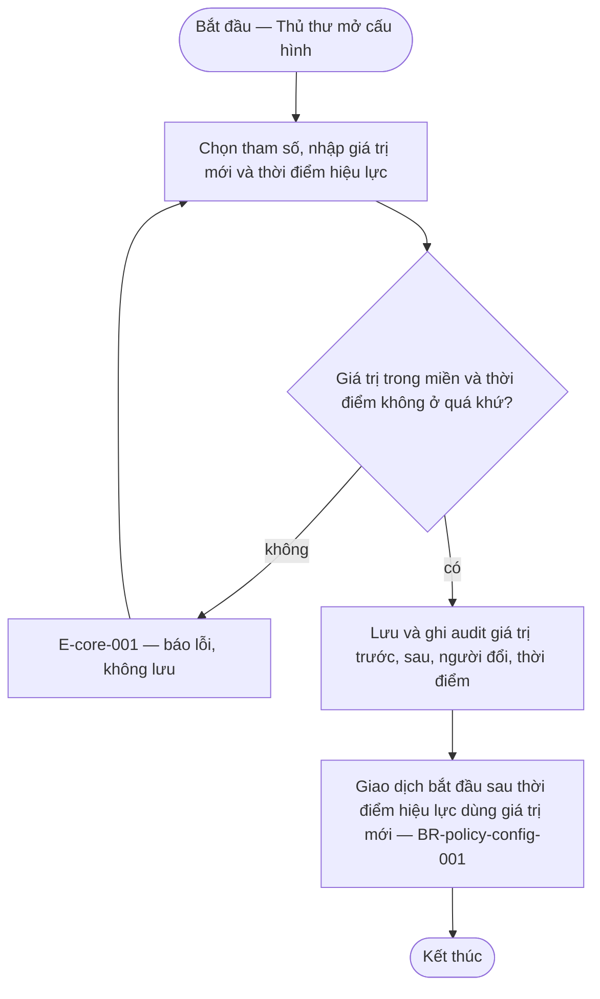

# policy-config — Flows

## Flow: Đổi tham số quy định

**Trigger:** Thủ thư đổi một tham số. · **UC:** uc-policy-config · **Release:** R0

```mermaid
flowchart TD
    Start(["Bắt đầu — Thủ thư mở cấu hình"]) --> Pick["Chọn tham số, nhập giá trị mới và thời điểm hiệu lực"]
    Pick --> Valid{"Giá trị trong miền và thời điểm không ở quá khứ?"}
    Valid -->|"không"| Err["E-core-001 — báo lỗi, không lưu"]
    Err --> Pick
    Valid -->|"có"| Save["Lưu và ghi audit giá trị trước, sau, người đổi, thời điểm"]
    Save --> Apply["Giao dịch bắt đầu sau thời điểm hiệu lực dùng giá trị mới — BR-policy-config-001"]
    Apply --> End(["Kết thúc"])
```
