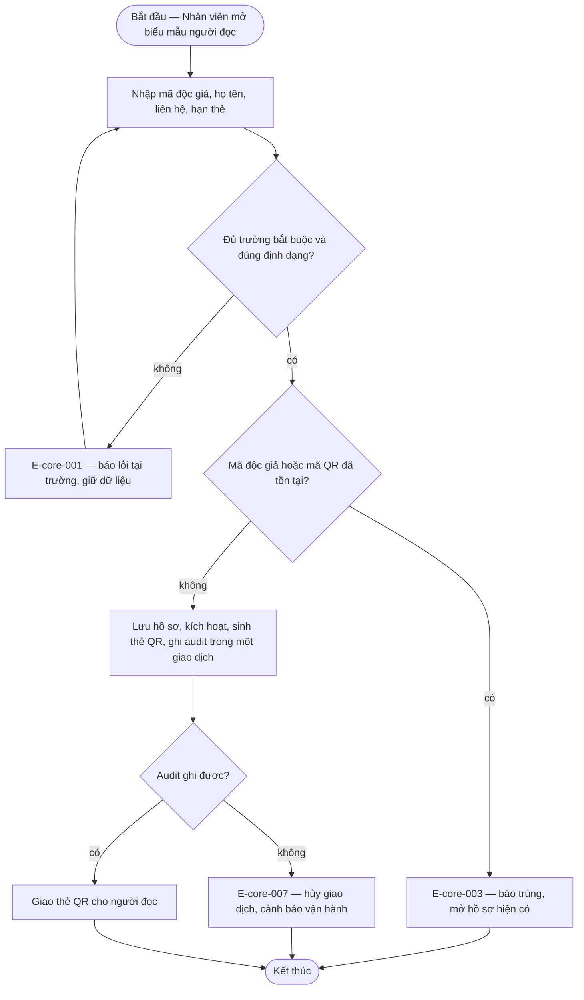

# reader-onboarding — Flows

## Flow: Cấp và kích hoạt tài khoản người đọc

**Trigger:** Người đọc đến quầy xin cấp thẻ. · **UC:** uc-reader-onboarding · **Release:** R0

```mermaid
flowchart TD
    Start(["Bắt đầu — Nhân viên mở biểu mẫu người đọc"]) --> Input["Nhập mã độc giả, họ tên, liên hệ, hạn thẻ"]
    Input --> Valid{"Đủ trường bắt buộc và đúng định dạng?"}
    Valid -->|"không"| Err1["E-core-001 — báo lỗi tại trường, giữ dữ liệu"]
    Err1 --> Input
    Valid -->|"có"| Dup{"Mã độc giả hoặc mã QR đã tồn tại?"}
    Dup -->|"có"| Err2["E-core-003 — báo trùng, mở hồ sơ hiện có"]
    Err2 --> End(["Kết thúc"])
    Dup -->|"không"| Save["Lưu hồ sơ, kích hoạt, sinh thẻ QR, ghi audit trong một giao dịch"]
    Save --> Audit{"Audit ghi được?"}
    Audit -->|"không"| Roll["E-core-007 — hủy giao dịch, cảnh báo vận hành"]
    Roll --> End
    Audit -->|"có"| Give["Giao thẻ QR cho người đọc"]
    Give --> End
```
