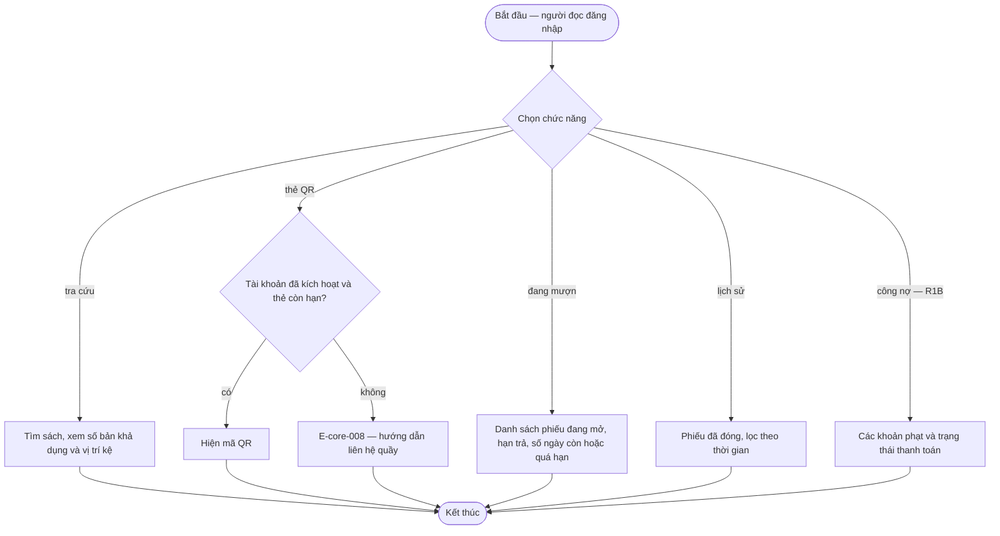

# reader-self-service — Flows

## Flow: Tự phục vụ người đọc

**Trigger:** Người đọc mở cổng người đọc. · **UC:** uc-reader-self-service · **Release:** R1A, R1B

```mermaid
flowchart TD
    Start(["Bắt đầu — người đọc đăng nhập"]) --> Menu{"Chọn chức năng"}
    Menu -->|"tra cứu"| Search["Tìm sách, xem số bản khả dụng và vị trí kệ"]
    Menu -->|"thẻ QR"| Card{"Tài khoản đã kích hoạt và thẻ còn hạn?"}
    Card -->|"có"| Show["Hiện mã QR"]
    Card -->|"không"| CardErr["E-core-008 — hướng dẫn liên hệ quầy"]
    Menu -->|"đang mượn"| Loans["Danh sách phiếu đang mở, hạn trả, số ngày còn hoặc quá hạn"]
    Menu -->|"lịch sử"| History["Phiếu đã đóng, lọc theo thời gian"]
    Menu -->|"công nợ — R1B"| Debt["Các khoản phạt và trạng thái thanh toán"]
    Search --> End(["Kết thúc"])
    Show --> End
    CardErr --> End
    Loans --> End
    History --> End
    Debt --> End
```
