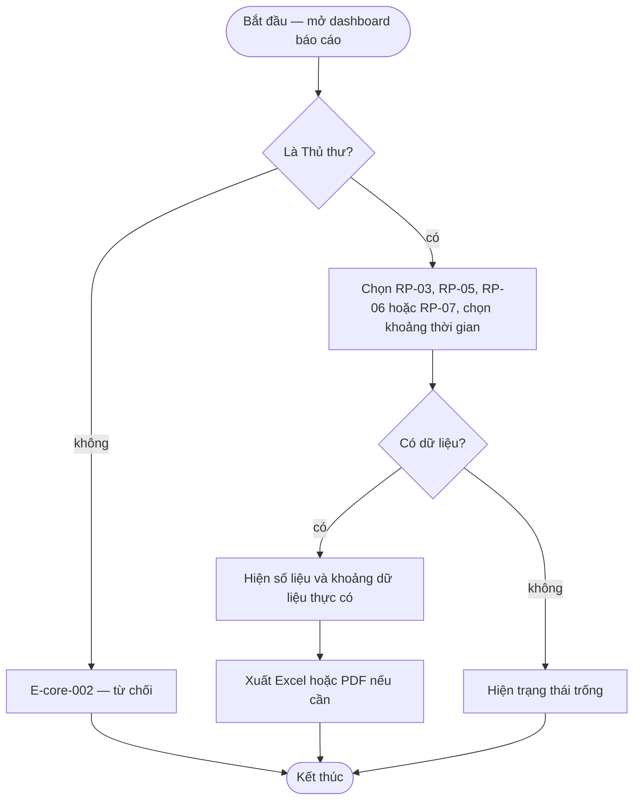

# trend-reports — Flows

## Flow: Xem và xuất báo cáo xu hướng

**Trigger:** Thủ thư mở báo cáo xu hướng. · **UC:** uc-trend-reports · **Release:** R2

```mermaid
flowchart TD
    Start(["Bắt đầu — mở dashboard báo cáo"]) --> Perm{"Là Thủ thư?"}
    Perm -->|"không"| Deny["E-core-002 — từ chối"]
    Deny --> End(["Kết thúc"])
    Perm -->|"có"| Pick["Chọn RP-03, RP-05, RP-06 hoặc RP-07, chọn khoảng thời gian"]
    Pick --> Data{"Có dữ liệu?"}
    Data -->|"không"| Empty["Hiện trạng thái trống"]
    Data -->|"có"| Show["Hiện số liệu và khoảng dữ liệu thực có"]
    Show --> Export["Xuất Excel hoặc PDF nếu cần"]
    Export --> End
    Empty --> End
```
